# Serverless CI/CD Security with AWS CodePipeline and Check Point CloudGuard Workload:
## Deploying and securing AWS Lambda functions with AWS CodePipeline and Check Point Serverless Security

**Check Point CloudGuard Workload** is the serverless security solution from Check Point Software. It will provide build and runtime security for serverless applications.

The Build security or **Proact** does static scanning analysis of the code and security posture management.
The Runtime **FSP(function Self protection)** does runtime security by whitelisting the behavior of the application. 
CloudGuard workload can be integrated in any CI/CD pipeline with plugins available either via SAM or CLI for example. SAM or Serverless Application Model is the AWS Open Source framework for creating serverless applications (https://aws.amazon.com/serverless/sam/).

In this tutorial, we will be using AWS CodePipeline to deploy a serverless application and add Cloudguard Workload as a step in the build and deploy phases of the CI/CD pipeline. We will show how to build a simple Lambda function using the AWS SAM CLI and then create a CICD pipeline with AWS CodePipeline to build, secure and deploy that Lambda function. 
We will integrate the Cloudguard Workload serverless security to AWS CodePipeline using the CLI plugin to perform Governance, Deep code analysis and Runtime application security. The proact feature perform the posture management check and SAST(Static Application Security Testing) while the Function Self Protection performs the runtime security or RAST(Runtime Application Security Testing).

It is important to note that there are other methods besides AWS SAM to build and package a lambda function such as the Serverless framework. please refer to my Tutorial using the Open Serverless Framework. For more information about AWS Codepipeline. https://aws.amazon.com/codepipeline/

 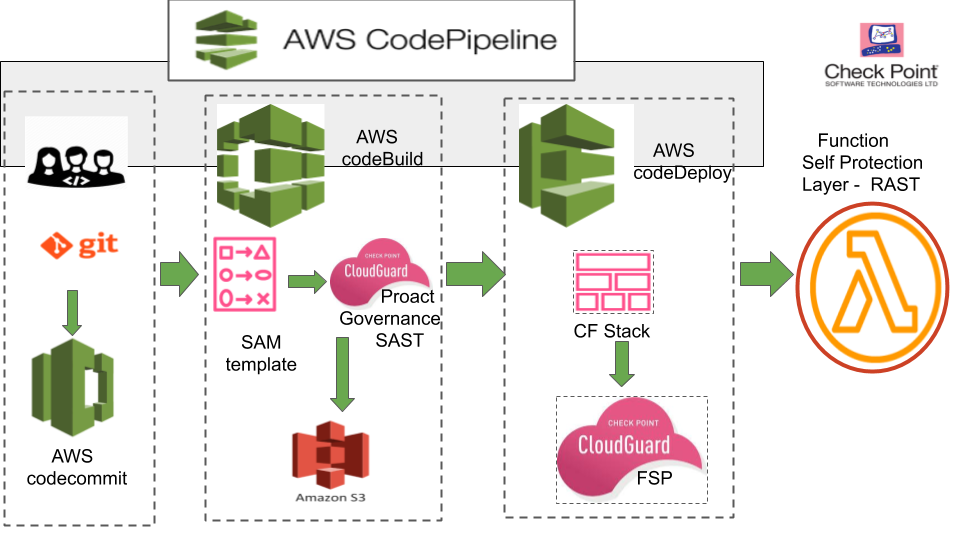 
 
## Prerequesites:
On your laptop, please install the following:

> Install AWS CLI https://docs.aws.amazon.com/cli/latest/userguide/install-cliv2.html

> Install SAM CLI https://docs.aws.amazon.com/serverless-application-model/latest/developerguide/serverless-sam-cli-install.html

> Install Git https://git-scm.com/book/en/v2/Getting-Started-Installing-Git

> Please note that I will be using MacOS in this tutorial and feel free to use any OS of your choice.

The AWS CodePipeline create a CICD pipeline to build and deploy a Lambda function as described in the picture above. We will using the SAM cli  to generate the source code for the Lambda and needed templates that are needed in the build and deploy phases. 

## This tutorial will teach you step by step how to create a AWS Codepipeline with CloudGuard Workload Serverless security:
It is important to plan the creation of the ressources needed in the CICD pipeline:
* Create a Repository on your laptop using Git and on AWS using AWS CodeCommit or GitHub. When a change or a commit is made it will be passed to an S3 bucket and then to Code Build
* A Build Project in AWS CodeBuild to checkout the code from AWS CodeCommit and package it. This includes the source code in a handler.js file, the SAM template yaml file and the Build specification yaml file or Buildspec.yaml. The Buildspec file defines flow of the various commands needed in each CICD stage in order to package and deploy the application using the SAM template. The CloudGuard serverless security will be integrated in CodeBuild with the Buildspec file using the CLI plugin.
* A CloudFormation Stack and Changeset to deploy the Lambda function in the Deploy phase. A cloudFormation stack will be needed to create a changeset and if you are not able to write a stack template, we will use the SAM deploy code to create one.
* IAM roles for all these AWS services will have to be created and needed permissions will have to be added for the CICD pipeline to execute successfully from build to deploy.
* The plugin for the Serveless security and CLI commands required by CloudGuard Workload in the Build and Runtime phases.

### Let's get started!

We will first use SAM to create a serverless project named here **cloudguard-app** for a simple node.js12.x serverless application. You can use your own source code and runtime with SAM if you prefer. This Tutorial applies to any serverless application that you chose to deploy. This will create a project directory that I named ./cloudguard-app but you can name the SAM project directory anything you want.

 

## The following ressources were generated as below:

**buildspec.yml** this file is used by AWS CodeBuild to define the build stage steps to package your application for deployment to AWS - - Lambda and add the cloudguard workload build and runtime security with proact and FSP(Function Self Protect)

**index.js** this file contains the sample Node.js 12.x code for the web service

**template.yml** A template that defines the application's AWS resources

**tests/** this directory contains unit tests for your application. This is optional but testing and feedback is a key component of     DevOps.

The Application is a simple node.js 12.x application that will return a string when invoked ..'Serverless Apps secured by CloudGuard Workload!

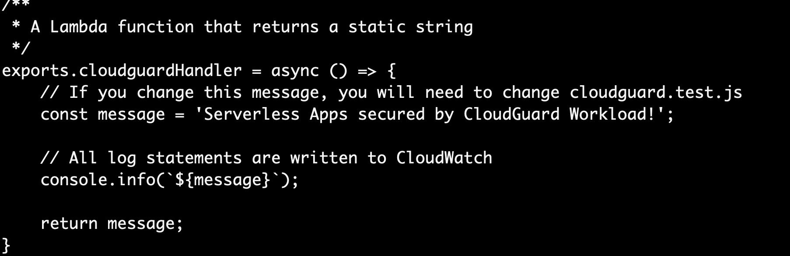 

The SAM template or **template.yml** defines the serverless application: 

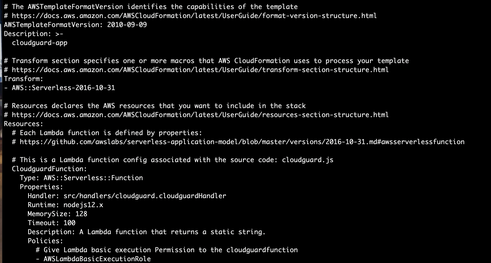 

The build specification file or **Buildspec.yml** defines the required packages and uploads the deployment package to a Amazon S3 bucket.
You will have to create a AWS S3 bucket and add its name to the file and add the CloudGuard Workload CLI plugin to define Proact or the governance and static code scanning as well as the runtime application security testing with the Fuction Self Protection or FSP.
Lets first create the S3 bucket and do not forget to ADD to add IAM permission to CodeBuild role to access the S3 bucket or the build phases will fail with an error. You can use the aws command below:

> aws s3 mb s3://cloudguard-bucket

 

Add CloudGuard Workload security using the CLI plugin and configure the proact and the fsp. Please refer the annotations in the build and deploy stages or phases: 

**Note: A CloudGuard API token is required with the cloudguard commands to execute successfuly and you can add the token using the -t option or add a cloudguard-config.json file in your repository** 

 

Its now time to intialize your project directory with Git, add all the needed files and commit them to your project.
For Repository, I am using AWS CodeCommit. If AWS Codecommit, you will first need to add AWS CodeCommit IAM permissions to your AWS account role in order to be able to push all the commited files to the AWS CodeCommit repository. 
https://docs.aws.amazon.com/IAM/latest/UserGuide/id_credentials_ssh-keys.html
If you are using GitHub then you will need your SSH public key to your GitHub Repository.

 

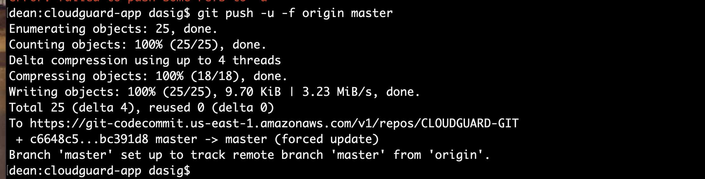 

# CodeCommit

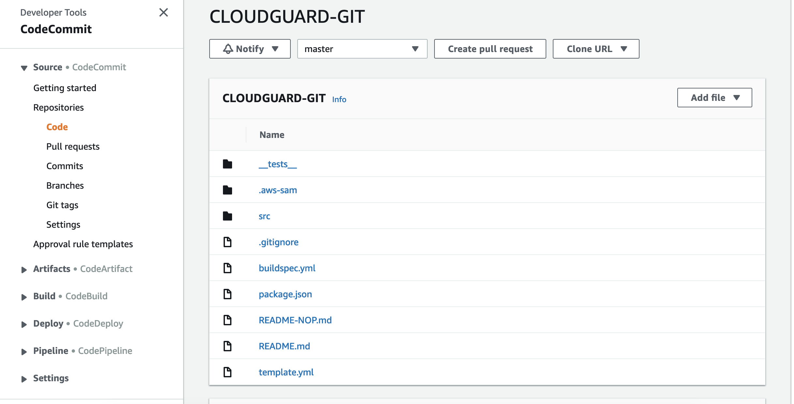 

# CodePipeline

We are now ready to create the AWS CodePipeline at the CodePipeline service menu.
Enter a name for your pipeline. you can keep the rest of the settings as default as an IAM role for the codepipeline will be created

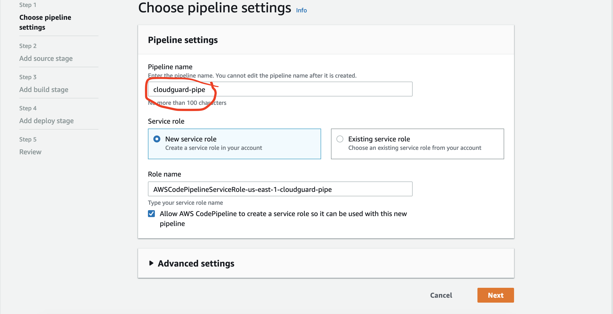 

Then chose your repository and branch ..in our case the repository you created and the default branch master

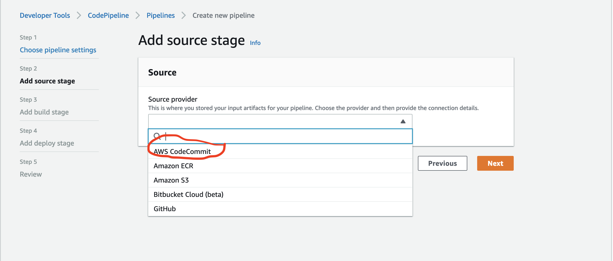 

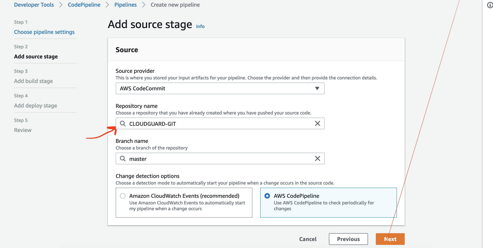 

# CodeBuild

For Build provider, choose AWS CodeBuild, and then choose Create project:

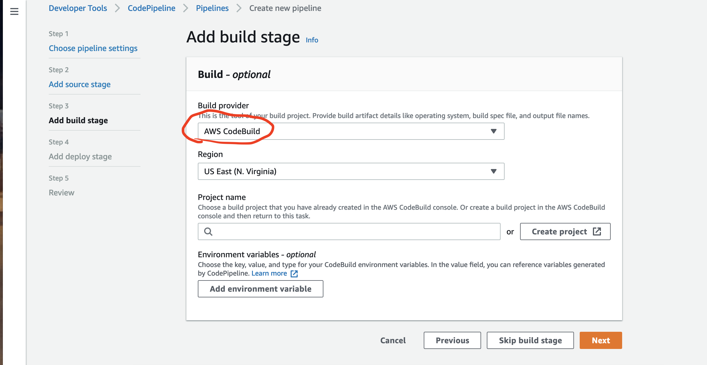 

### Configure build project settings and choose Continue to CodePipeline.

* Project name – <your project name> in my case cloudguard-project

* Operating system – Ubuntu

* Runtime – Standard

* Runtime version – aws/codebuild/standard:3.0 ( The app is in node.js 12.x requiring ver3.0)

* Image version – Latest

* Buildspec name – buildspec.yml

> **Please note the CodeBuild IAM role name as you will have to add permissions to allow access to all needed AWS ressources or the pipeline will FAIL..

> codebuild-cloudguard-cicd-project-service-role

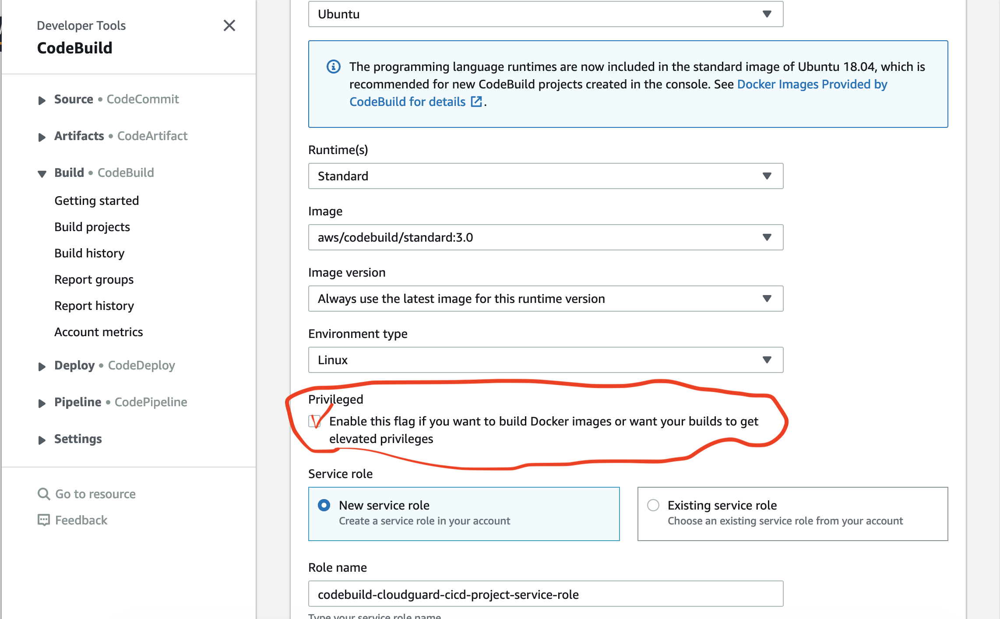 

We now move to the **Deploy stage** and we will use CloudFormation as the Deploy provider:

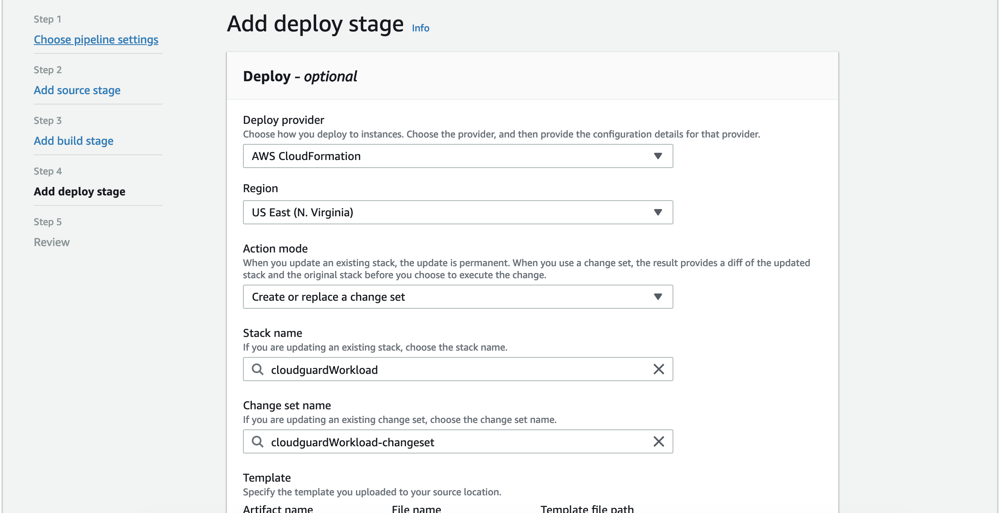 

* **Deploy provider**: CloudFormation - we use that to deploy our serverless function using a CF Stack and ChangeSet.

* **Region**: your AWS region

* **Stack name** - the name of the cloudformation stack to deploy the lambda 

> You will have to first create a CloudFormation Stack which will be used by CodeDeploy to create a ChangeSet.
You can use the cloudFormation Stack Template is as below or you can write you own. Please refer to the AWS Docs for more details.

```
AWSTemplateFormatVersion: 2010-09-09
Description: cloudguard-app
Resources:
  CloudguardFunction:
    Type: 'AWS::Lambda::Function'
    Properties:
      Code:
        S3Bucket: <your_bucket>
        S3Key: <your_bucket_key>
      Description: A Lambda function that returns a static string.
      Tags:
        - Value: SAM
          Key: 'lambda:createdBy'
      MemorySize: 128
      Handler: src/handlers/cloudguard.cloudguardHandler
      Role: !GetAtt 
        - CloudguardFunctionRole
        - Arn
      Timeout: 100
      Runtime: nodejs12.x
  CloudguardFunctionRole:
    Type: 'AWS::IAM::Role'
    Properties:
      AssumeRolePolicyDocument:
        Version: 2012-10-17
        Statement:
          - Action:
              - 'sts:AssumeRole'
            Effect: Allow
            Principal:
              Service:
                - lambda.amazonaws.com
      ManagedPolicyArns:
        - 'arn:aws:iam::aws:policy/service-role/AWSLambdaBasicExecutionRole'
      Tags:
        - Value: SAM
          Key: 'lambda:createdBy'
          
```
* **Change changeSet name** - add a name for the cloudformation ChangeSet..just append 'Changeset' to the name of your stack

* **Template** - input filename as template-export.yml as defined in your Buildspec.yml **output template** file - 

* **Capabilities**: chose CAPABILITY_IAM and CAPABILITY_AUTO_EXPAND.

* **RoleName**: the name of the IAM role you need to create for AWS CloudFormation role for CodeDeploy. Please create a IAM Role with the following permissions as inline policy and name it anything you want. Note This is NOT a final template and you will need to add more permissions if you are deploying more serverless services like apigateway or dynamodb using cloudformation. I am ONLY deploying a Lambda funtion here..

```
{
    "Statement": [
        {
            "Action": [
               
                "codedeploy:*",
                "lambda:*",   <----- 
                "cloudformation:CreateChangeSet",
                "iam:GetRole",
                "iam:CreateRole",
                "iam:DeleteRole",
                "iam:PutRolePolicy",
                "iam:AttachRolePolicy",
                "iam:DeleteRolePolicy",
                "iam:DetachRolePolicy",
                "iam:PassRole",
                "s3:GetObject",
                "s3:GetObjectVersion",
                "s3:GetBucketVersioning"
            ],
            "Resource": "*",
            "Effect": "Allow"
        }
    ],
    "Version": "2012-10-17"
}

```
## Create Pipeline and Release Changes

You have trigerred the pipeline to run and you can monitor the pipeline execution under the CodeBuild Phase logs under Build Logs.
you can see that*
* During Proact, CloudGuard Workload did not find any malicious code after SAST scanning but flagged the Lambda role as too permissive. 
* The FSP runtime security was added succesfully to the Lambda function. A secure IAM permission will be suggested in the cloudguard log for the app or security team to take action. In this case, Proact was set to alert only mode but can be changed to fail the pipeline when malicious CVEs or permissibe roles are found.
  You have deployed and secured successfuly your serverless applications:

 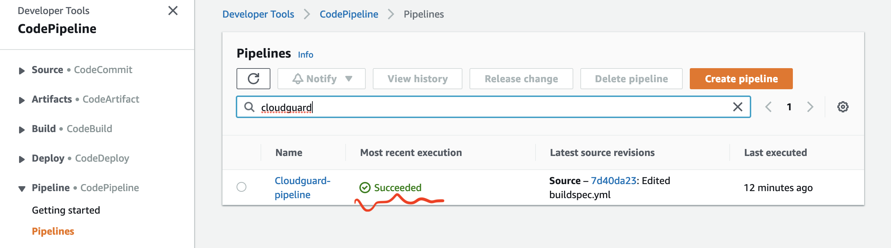 
 

```
[Container] 2020/06/13 15:33:37 Waiting for agent ping
[Container] 2020/06/13 15:33:39 Waiting for DOWNLOAD_SOURCE
[Container] 2020/06/13 15:33:40 Phase is DOWNLOAD_SOURCE
[Container] 2020/06/13 15:33:40 CODEBUILD_SRC_DIR=/codebuild/output/src107669042/src
[Container] 2020/06/13 15:33:40 YAML location is /codebuild/output/src107669042/src/buildspec.yml
[Container] 2020/06/13 15:33:40 Processing environment variables
[Container] 2020/06/13 15:33:41 No runtime version selected in buildspec.
[Container] 2020/06/13 15:33:41 Moving to directory /codebuild/output/src107669042/src
[Container] 2020/06/13 15:33:41 Registering with agent
[Container] 2020/06/13 15:33:41 Phases found in YAML: 4
[Container] 2020/06/13 15:33:41  POST_BUILD: 1 commands
[Container] 2020/06/13 15:33:41  INSTALL: 2 commands
[Container] 2020/06/13 15:33:41  PRE_BUILD: 1 commands
[Container] 2020/06/13 15:33:41  BUILD: 5 commands
[Container] 2020/06/13 15:33:41 Phase complete: DOWNLOAD_SOURCE State: SUCCEEDED
[Container] 2020/06/13 15:33:41 Phase context status code:  Message: 
[Container] 2020/06/13 15:33:41 Entering phase INSTALL
[Container] 2020/06/13 15:33:41 Running command npm install
npm WARN deprecated fsevents@1.2.13: fsevents 1 will break on node v14+ and could be using insecure binaries. Upgrade to fsevents 2.
npm WARN deprecated left-pad@1.3.0: use String.prototype.padStart()
npm WARN deprecated request@2.88.2: request has been deprecated, see https://github.com/request/request/issues/3142
npm WARN deprecated resolve-url@0.2.1: https://github.com/lydell/resolve-url#deprecated
npm WARN deprecated urix@0.1.0: Please see https://github.com/lydell/urix#deprecated
npm notice created a lockfile as package-lock.json. You should commit this file.
npm WARN optional SKIPPING OPTIONAL DEPENDENCY: fsevents@^1.2.7 (node_modules/jest-haste-map/node_modules/fsevents):
npm WARN notsup SKIPPING OPTIONAL DEPENDENCY: Unsupported platform for fsevents@1.2.13: wanted {"os":"darwin","arch":"any"} (current: {"os":"linux","arch":"x64"})

added 466 packages from 365 contributors and audited 467 packages in 13.603s

18 packages are looking for funding
  run `npm fund` for details

found 0 vulnerabilities


[Container] 2020/06/13 15:34:01 Running command pip install --upgrade awscli
Collecting awscli
  Downloading https://files.pythonhosted.org/packages/53/83/66aba3e6663302dab7cdd2cf619da22d305867d1607467cf41a7874a4c68/awscli-1.18.79-py2.py3-none-any.whl (3.2MB)
Requirement already satisfied, skipping upgrade: s3transfer<0.4.0,>=0.3.0 in /root/.pyenv/versions/3.8.1/lib/python3.8/site-packages (from awscli) (0.3.3)
Requirement already satisfied, skipping upgrade: docutils<0.16,>=0.10 in /root/.pyenv/versions/3.8.1/lib/python3.8/site-packages (from awscli) (0.15.2)
Requirement already satisfied, skipping upgrade: PyYAML<5.4,>=3.10; python_version != "3.4" in /root/.pyenv/versions/3.8.1/lib/python3.8/site-packages (from awscli) (5.1.2)
Collecting botocore==1.17.2
  Downloading https://files.pythonhosted.org/packages/65/5c/8e001190db89151347c497e8faa6fc1059acc8c0079b9adffa1f0ee2fe82/botocore-1.17.2-py2.py3-none-any.whl (6.3MB)
Requirement already satisfied, skipping upgrade: rsa<=3.5.0,>=3.1.2 in /root/.pyenv/versions/3.8.1/lib/python3.8/site-packages (from awscli) (3.4.2)
Requirement already satisfied, skipping upgrade: colorama<0.4.4,>=0.2.5; python_version != "3.4" in /root/.pyenv/versions/3.8.1/lib/python3.8/site-packages (from awscli) (0.4.3)
Requirement already satisfied, skipping upgrade: urllib3<1.26,>=1.20; python_version != "3.4" in /root/.pyenv/versions/3.8.1/lib/python3.8/site-packages (from botocore==1.17.2->awscli) (1.25.9)
Requirement already satisfied, skipping upgrade: jmespath<1.0.0,>=0.7.1 in /root/.pyenv/versions/3.8.1/lib/python3.8/site-packages (from botocore==1.17.2->awscli) (0.9.5)
Requirement already satisfied, skipping upgrade: python-dateutil<3.0.0,>=2.1 in /root/.pyenv/versions/3.8.1/lib/python3.8/site-packages (from botocore==1.17.2->awscli) (2.8.0)
Requirement already satisfied, skipping upgrade: pyasn1>=0.1.3 in /root/.pyenv/versions/3.8.1/lib/python3.8/site-packages (from rsa<=3.5.0,>=3.1.2->awscli) (0.4.8)
Requirement already satisfied, skipping upgrade: six>=1.5 in /root/.pyenv/versions/3.8.1/lib/python3.8/site-packages (from python-dateutil<3.0.0,>=2.1->botocore==1.17.2->awscli) (1.14.0)
ERROR: boto3 1.12.49 has requirement botocore<1.16.0,>=1.15.49, but you'll have botocore 1.17.2 which is incompatible.
Installing collected packages: botocore, awscli
  Found existing installation: botocore 1.15.49
    Uninstalling botocore-1.15.49:
      Successfully uninstalled botocore-1.15.49
  Found existing installation: awscli 1.18.49
    Uninstalling awscli-1.18.49:
      Successfully uninstalled awscli-1.18.49
Successfully installed awscli-1.18.79 botocore-1.17.2
WARNING: You are using pip version 19.3.1; however, version 20.1.1 is available.
You should consider upgrading via the 'pip install --upgrade pip' command.

[Container] 2020/06/13 15:34:17 Phase complete: INSTALL State: SUCCEEDED
[Container] 2020/06/13 15:34:17 Phase context status code:  Message: 
[Container] 2020/06/13 15:34:17 Entering phase PRE_BUILD
[Container] 2020/06/13 15:34:17 Running command npm prune --production
removed 466 packages in 18.677s
found 0 vulnerabilities


[Container] 2020/06/13 15:34:36 Phase complete: PRE_BUILD State: SUCCEEDED
[Container] 2020/06/13 15:34:36 Phase context status code:  Message: 
[Container] 2020/06/13 15:34:36 Entering phase BUILD
[Container] 2020/06/13 15:34:36 Running command npm install -g https://artifactory.app.protego.io/cloudguard-serverless-plugin.tgz
npm WARN deprecated core-js@2.6.11: core-js@<3 is no longer maintained and not recommended for usage due to the number of issues. Please, upgrade your dependencies to the actual version of core-js@3.
/usr/local/bin/protego -> /usr/local/lib/node_modules/serverless-cloudguard-plugin/bin/protego.js
/usr/local/bin/cloudguard -> /usr/local/lib/node_modules/serverless-cloudguard-plugin/bin/cloudguard.js

> core-js@2.6.11 postinstall /usr/local/lib/node_modules/serverless-cloudguard-plugin/node_modules/core-js
> node -e "try{require('./postinstall')}catch(e){}"

·[96mThank you for using core-js (·[94m https://github.com/zloirock/core-js ·[96m) for polyfilling JavaScript standard library!·[0m

·[96mThe project needs your help! Please consider supporting of core-js on Open Collective or Patreon: ·[0m
·[96m>·[94m https://opencollective.com/core-js ·[0m
·[96m>·[94m https://www.patreon.com/zloirock ·[0m

·[96mAlso, the author of core-js (·[94m https://github.com/zloirock ·[96m) is looking for a good job -)·[0m

+ serverless-cloudguard-plugin@10.1.22
added 281 packages from 234 contributors in 11.45s

[Container] 2020/06/13 15:34:48 Running command export  AWS_REGION=us-east-1

[Container] 2020/06/13 15:34:48 Running command cloudguard proact -m template.yml
Container cmd: docker
Container options empty
Returning docker user: 0:0
No args required for docker
[cloudguard-cli: proact] Initializing... 
Updating Proact | [----------------------------------------] 0% | ETA: 0s
Updating Proact | [========================================] 100% | ETA: 0s

[cloudguard-cli: proact]  - Initializing docker (protego/protego-runtime:latest) - please wait, this action may take some time ... 
[cloudguard-cli: proact] Initializing, Done. 
[cloudguard-cli: proact]  | --- Scanning --- | please wait, this action may take some time ... 
Using Only Sam template: template.yml
Parsing Template ... -······················Parsing Template ... \······················Parsing Template ... |······················Parsing Template ... /······················Parsing Template ... -······················Parsing Template ... \······················Parsing Template ... |······················
·[K·[A
( 0 / 1 ) -···········( 0 / 1 ) \···········( 0 / 1 ) |···········( 0 / 1 ) /···········( 0 / 1 ) -···········( 0 / 1 ) \···········( 0 / 1 ) |···········( 0 / 1 ) /···········( 0 / 1 ) -···········( 0 / 1 ) \···········( 0 / 1 ) |···········( 0 / 1 ) /···········( 0 / 1 ) -···········( 0 / 1 ) \···········( 0 / 1 ) |···········( 0 / 1 ) /···········( 0 / 1 ) -···········( 0 / 1 ) \···········( 0 / 1 ) |···········( 0 / 1 ) /···········( 0 / 1 ) -···········( 0 / 1 ) \···········( 0 / 1 ) |···········( 0 / 1 ) /···········( 0 / 1 ) -···········( 0 / 1 ) \···········( 0 / 1 ) |···········( 0 / 1 ) /···········( 0 / 1 ) -···········( 0 / 1 ) \···········( 0 / 1 ) |···········( 0 / 1 ) /···········( 0 / 1 ) -···········( 0 / 1 ) \···········( 0 / 1 ) |···········( 0 / 1 ) /···········( 0 / 1 ) -···········( 0 / 1 ) \···········( 0 / 1 ) |···········( 0 / 1 ) /···········( 0 / 1 ) -···········( 0 / 1 ) \···········( 0 / 1 ) |···········( 0 / 1 ) /···········( 0 / 1 ) -···········( 0 / 1 ) \···········( 0 / 1 ) |···········( 0 / 1 ) /···········( 0 / 1 ) -···········( 0 / 1 ) \···········( 0 / 1 ) |···········( 0 / 1 ) /···········( 0 / 1 ) -···········( 0 / 1 ) \···········( 0 / 1 ) |···········( 0 / 1 ) /···········( 0 / 1 ) -···········( 0 / 1 ) \···········( 0 / 1 ) |···········( 0 / 1 ) /···········( 0 / 1 ) -···········( 0 / 1 ) \···········( 0 / 1 ) |···········( 0 / 1 ) /···········( 0 / 1 ) -···········( 0 / 1 ) \···········( 0 / 1 ) |···········( 0 / 1 ) /···········( 0 / 1 ) -···········( 0 / 1 ) \···········( 0 / 1 ) |···········( 0 / 1 ) /···········( 0 / 1 ) -···········( 0 / 1 ) \···········( 0 / 1 ) |···········( 0 / 1 ) /···········( 1 / 1 ) -···········
·[K·[A

λ: (·[32m✓·[0m) helloFromCloudGuardFunction
-----------------------------------
    PermissiveRole : ·[33mWarning (Low)·[0m - Role Too Permissive
    VulnerableDependency : ·[32mSucceeded·[0m
    CredentialsUsage : ·[32mSucceeded·[0m
    RuleViolation : ·[32mSucceeded·[0m
Detailed output: ·[36mcloudguard_output/helloFromCloudGuardFunction.yaml·[0m
-----------------------------------

Number of failed functions: 0
Scan detailed output: ·[36mfile:////codebuild/output/src107669042/src/cloudguard_output/CloudGuardScanResults.yaml·[0m
Scan detailed report (HTML): ·[36mfile:////codebuild/output/src107669042/src/cloudguard_output/CloudGuardScanReport.html·[0m


[Container] 2020/06/13 15:35:46 Running command export S3_BUCKET=cicd-cp

[Container] 2020/06/13 15:35:46 Running command aws cloudformation package --template template.yml --s3-bucket $S3_BUCKET --output-template template-export.yml

Uploading to c5a63e96a54d0966acaba847e475d5f5  66427 / 66427.0  (100.00%)
Successfully packaged artifacts and wrote output template to file template-export.yml.
Execute the following command to deploy the packaged template
aws cloudformation deploy --template-file /codebuild/output/src107669042/src/template-export.yml --stack-name <YOUR STACK NAME>

[Container] 2020/06/13 15:35:49 Phase complete: BUILD State: SUCCEEDED
[Container] 2020/06/13 15:35:49 Phase context status code:  Message: 
[Container] 2020/06/13 15:35:49 Entering phase POST_BUILD
[Container] 2020/06/13 15:35:49 Running command cloudguard fsp -c arn:aws:cloudformation:us-east-1:392332258562:stack/cicd-app/1b29e940-aadc-11ea-9d90-0e6f11df9e98
[cloudguard-cli: fsp] FSP:: loadDependencies 
[cloudguard-cli: fsp] Initializing... 
Updating FSP Plugin | [----------------------------------------] 0% | ETA: 0s
Updating FSP Plugin | [========================================] 100% | ETA: 0s

[cloudguard-cli: fsp] Initializing, Done. 
[cloudguard-cli] Fetching functions list from CF stack arn:aws:cloudformation:us-east-1:392332258562:stack/cicd-app/1b29e940-aadc-11ea-9d90-0e6f11df9e98
[cloudguard-cli] Protego FSP (v1.5.10) Instrumentation Succeeded ✓ 
[cloudguard-cli]   - function ARN  :  arn:aws:lambda:us-east-1:392332258562:function:cicd-app-helloFromCloudGuardFunction-84DCWOMAMPN8:$LATEST
[cloudguard-cli]   - runtime       :  nodejs12.x
[cloudguard-cli]   - layer         :  arn:aws:lambda:us-east-1:634729597623:layer:magnatar-protego-fsp-nodejs-layer:13
[cloudguard-cli]   - environment   :  {"PROTEGO_FSP_CUSTOMER_ACCOUNT_ID":"392332258562:5fb60bdda995cc53ad09fe836f40a721","NODE_OPTIONS":"--require @protego/protego-node-agent"}
[cloudguard-cli] 
Protego - FSP (1.5.10) Summary:

  Protected Functions (1) :
    ✓ arn:aws:lambda:us-east-1:392332258562:function:cicd-app-helloFromCloudGuardFunction-84DCWOMAMPN8:$LATEST:  Protected 
 

[Container] 2020/06/13 15:35:53 Phase complete: POST_BUILD State: SUCCEEDED
[Container] 2020/06/13 15:35:53 Phase context status code:  Message: 
[Container] 2020/06/13 15:35:53 Expanding base directory path: .
[Container] 2020/06/13 15:35:53 Assembling file list
[Container] 2020/06/13 15:35:53 Expanding .
[Container] 2020/06/13 15:35:53 Expanding file paths for base directory .
[Container] 2020/06/13 15:35:53 Assembling file list
[Container] 2020/06/13 15:35:53 Expanding template.yml
[Container] 2020/06/13 15:35:53 Expanding template-export.yml
[Container] 2020/06/13 15:35:53 Found 2 file(s)
[Container] 2020/06/13 15:35:53 Phase complete: UPLOAD_ARTIFACTS State: SUCCEEDED
[Container] 2020/06/13 15:35:53 Phase context status code:  Message: 

```

You can verify that the FSP Runtime security was added as Layer to my deployed Lambda function at the AWS mgmt Console under Lamdba services:

 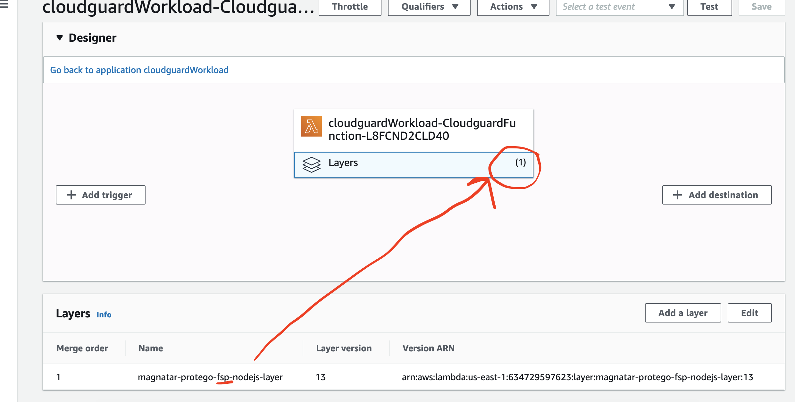 


#### if you would like to understand more about Serverless Security and CloudGuard Workload please feel free to reach to me or attend my webinars on TechTalk or BrightTalk. 
